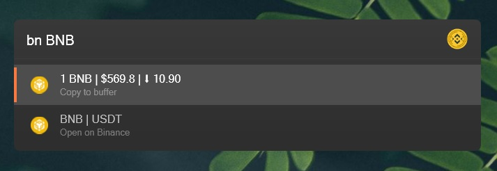

# Binance-Price Plugin

This plugin allows you to easily retrieve the current price of any cryptocurrency listed on the Binance exchange.

### Features:
- **Simple Price Lookup**: Enter the name of the cryptocurrency, and the plugin will display the price of 1 unit, along with the percentage change since your last check.
- **Custom Quantity Calculation**: If you specify a quantity along with the cryptocurrency name, you'll receive the total value for that amount.
- **Quick Actions**: 
  - Copy the price directly to your clipboard.
  - Open the trading page for the selected cryptocurrency on Binance.

To activate the plugin, use the keyword `bn`.
